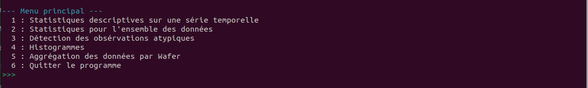
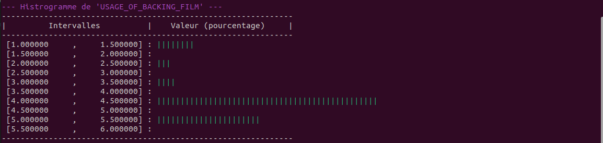
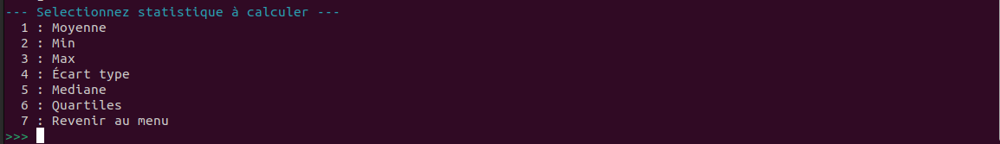
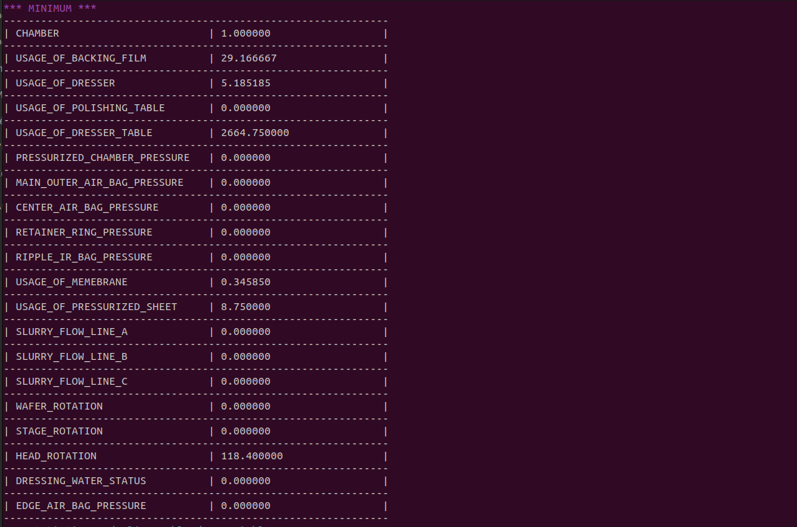

 #DOCUMENT EXPLICATIF DU PROGRAMME
 
 1 - EXÉCUTER LE PROGRAMME 
 
 	* SYSTÈME D'ÉXPLOITATION : Ce programme est conçu pour fonctionner sur linux , pour le faire fonctionner sur windows il faudra le démarrer manuellemnt avec 'make main'
 
 	* DONNÉES : le programme analyse les données des CPM elles sont stockées dans le dossier training, l'utilisateur est libre de d'ajouter d'autres données à celles qui sont déjà présentes 
 			    elles vont être lues automatiquement.
 	
 	* EXÉCUTER	Pour exécuter le programme il faut démarrer le script 'run.sh' dans le terminal. On conseille très fortment de le rendre exécutable avant avec 
 			la commande "$ chmod +x run.sh".
 	
 	* DÉMARRAGE	Au démarrage une fenêtre gedit sera ouverte, on s'attend à ce que l'utilisateur mette dans 'CHEMIN' et 'CHEMIN2' les chemins exactes respectivement vers le 
 			dossier 'training' et 'output'.
 			exemple:  CHEMIN "/home/adam/Documents/training/".
 	
 	* PROGRAMME	Une fois que vous aurez enregistré la fenêtre gedit et vous l'auriez fermée le programme démarre et affiche le menu principal.
 			Pour naviguer à l'intérieur du programme il suffit d'écrire le numéro de l'action que vous souhi=aitez faire.
 
 2 - FONCTIONNNALITÉS
 	
 	* Étude statistique :	On à la possibilité de faire des études statistiques soir sur un fichier précis et dans ce cas le programme nous demandera d'écrire le nom
 				précis, soit sur l'ensemble des fichier au même temps. Dans le deuxième cas nous avons aussi de sauvegarder les résultats dans un fichier dont on peut choisir le nom; 
 				ces résultats seront stockés dans le dossier training.
 	
 	* AFFICHER HISTOGRAMMES : 	On peut affihcer des histogrammes donnant des indications relatives à toutes les données d'un coup.
 					on peut choisir une variable précise dont on veut afficher l'histogramme.
 					Une barre represente 1%.
 		
 	* AGGRÉGATION PAR WAFER :	On peut tout d'abord afficher tous les wafers différents présents dans tous les fichiers.
 					On peut ensuite afficher les moyenne de chaque variable relative à un wafer précis
 					On peut enfin sauvegarder toutes les données sur tous les wafer dans un seul fichier

 5 - SCREENSHOTS
 

  
   
  
   
  
   
  

  
 
 4 - BUGS CONNUS
 	
 	* BUG1 : Si on écrit une lettre au lieux d'un chiffre lors de la navigation dans les menus le programme crash et il fait tout arrêter avec crtl+c.
 		Mais si on écrit un chiffre d'un menu qui n'existe pas le programme est capable de prendre en compte l'erreur
 	
 	* BUG2 : Ceci n'est pas vraiment un bug mais la sauvegarde des données des wafer dans le fichier peur s'avérer lente temps dattente de l'ordre de grandeur 
 		de la minute.		
 	 
 	
 										
